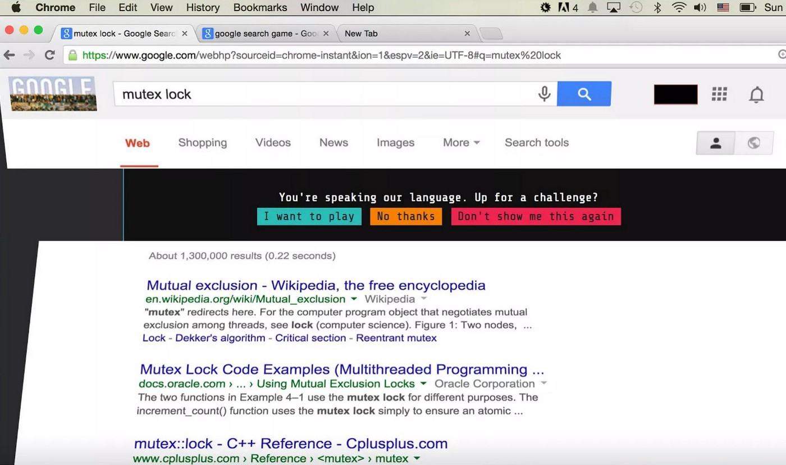

# What is Google Foobar Challenge?

  

Google Foobar is a secret Google challenge to recruit programmers. Or at least in some time it was his function according with internet rumors.

Google Foobar is a series of programming challenges presented like missions in a fun story where you are an infiltrate on Commander Lambda's space station (Death Star). Missions goes from translate words to braile in order to print signs to avoid lasers while you are scaping on a capsule pod.

  

