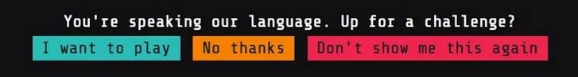

# What is Google Foobar Challenge?

  

Google Foobar is a secret Google challenge to recruit programmers. Or at least in some time it was his function according with internet rumors.

Google Foobar is a series of programming challenges presented like missions in a fun story where you are an infiltrate on Commander Lambda's space station (Death Star). Missions goes from translate words to braile in order to print signs to avoid lasers while you are scaping on a capsule pod.

There are similar challenges like [CodeSignal]('https://app.codesignal.com/') and [HackerRank]('https://www.hackerrank.com/dashboard'). But Foobar is more funny and much more challenging. You can pass first and second level using only logic. However starting 3 level you will find combinatory, math, graph problems. You will have sufficient time to code, but I invested most of these time reseach and understanding how the answer works and how implement them.

Understanding the answer? Yes, these problems has a discovered solution since many years ago. Like Ford Fulkerson algorithm to find max flow on a network which can be used to save bunnies on LV 4.

  

